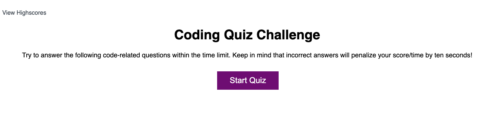

# Quiz Webpage

## Description
This webpage is setup as a multiple choice quiz about coding. It currently contains five questions but is easily updated to have more. The code also allows for the content of the quiz to be easily changed to fit other purposes.

## Installation
N/A

## Usage
In order to take the quiz simple press the "Start Quiz" button. The screen will change to the first question and the button layout will change to show a series of buttons with different answers.

Once you click and answer the screen will be updated again with a new question and selection of answers. After all five questions have been answered you will be shown your score and prompted to enter your initials. This information is stored locally and then displayed to you on the high scores screen. You will have the option to return to the main screen or to clear the high scores.

At any point in time you can get to the high scores screen by clicking the text "View Highscores" in the upper left hand side of the screen.

**NOTE: Clicking the "View Highscores" text will exit your current quiz attempt and you will be forced to restart. You will lose your current score!**

## Credits
N/A

## License
Please refer to the LICENSE in the repo.